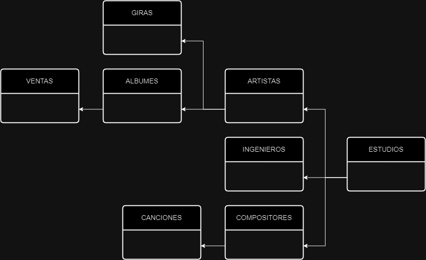
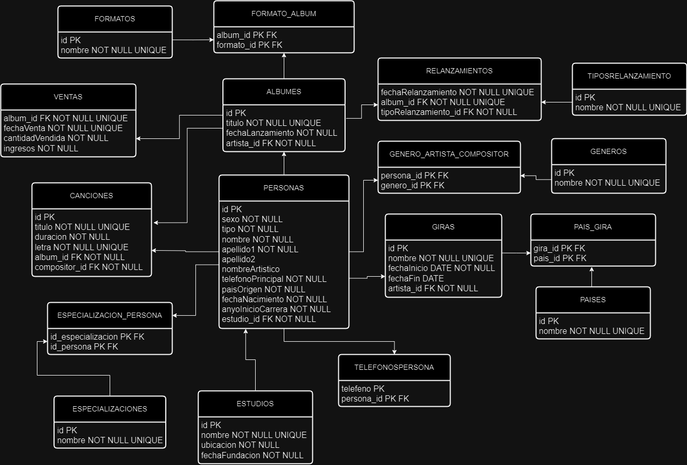
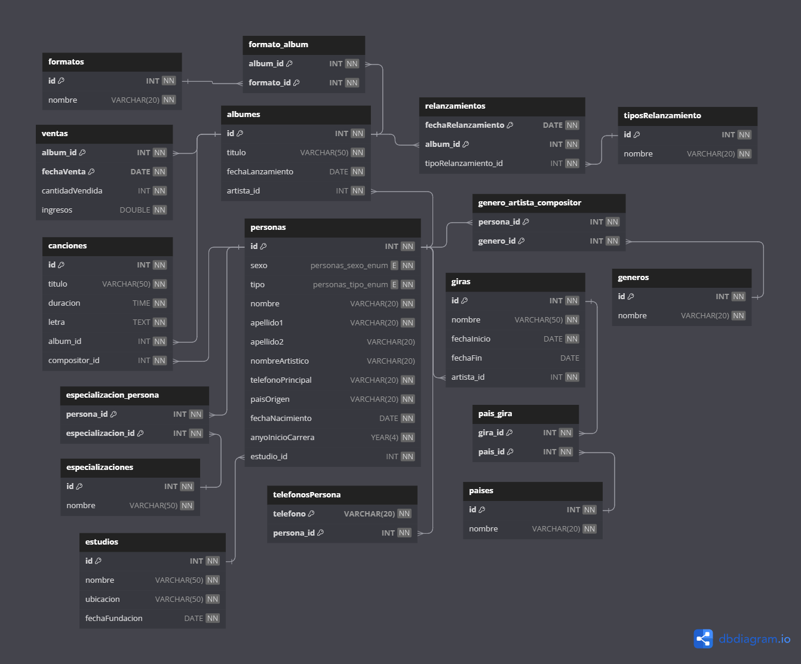

# Sistema de Gestión para una Discográfica

## Secciones

- [**Requisitos de Uso**](#requisitos-de-uso)
- [**Enunciado**](#enunciado)
- [**Requisitos Funcionales del Sistema**](#requisitos-funcionales)
- [**Restricciones del Sistema**](#restricciones)
- [**Consultas**](#consultas)
- [**Modelos (IMG)**](#modelos)
- [**Uso del Proyecto**](#uso-del-proyecto)

## Requisitos de Uso

Tener instalado un gestor de base de datos, preferiblemente **MySQL**, es fundamental para realizar consultas de forma eficiente.

## Enunciado

Una reconocida discográfica ha decidido modernizar su sistema de gestión para optimizar el manejo de la información sobre artistas, compositores, álbumes, canciones, estudios de grabación, ingenieros de sonido, fechas de lanzamiento, ventas y giras. La discográfica desea un sistema que le permita organizar eficientemente sus operaciones diarias, incluyendo el seguimiento de la producción musical, la gestión de eventos de lanzamiento, el control de ventas y el manejo de giras de artistas.

## Requisitos Funcionales

1. **Registro de Artistas:**
   - Almacenar información detallada sobre los artistas, incluyendo nombre, apellidos, nombre artístico, país de origen y año de inicio en la industria.

2. **Registro de Compositores:**
   - Almacenar información detallada sobre los compositores, incluyendo nombre, apellidos, país de origen y año de inicio en la industria.

3. **Catálogo de Álbumes y Canciones:**
   - Mantener un catálogo completo de álbumes, con detalles como título, fecha de lanzamiento y formato.
   - Registrar información detallada sobre cada canción, incluyendo título, duración, compositor y letra.

4. **Estudios de Grabación e Ingenieros de Sonido:**
   - Gestionar la información de los estudios de grabación, incluyendo nombre, ubicación y año de fundación.
   - Registrar los ingenieros de sonido asociados a cada estudio, con detalles sobre su nombre, apellidos y especialización.

5. **Fechas de Lanzamiento y Ventas:**
   - Seguir las fechas de lanzamiento y relanzamiento de álbumes.
   - Mantener un registro sobre los relanzamientos de álbumes como la fecha y el tipo de relanzamiento.
   - Registrar información sobre las ventas, incluyendo la cantidad vendida y los ingresos generados.

6. **Gestión de Giras:**
   - Mantener un registro de las giras de los artistas, incluyendo el nombre de la gira, la fecha de inicio y fin, así como los países visitados.

## Restricciones

### Personas

- Un artista puede abordar diferentes géneros musicales.
- Un compositor puede abordar diferentes géneros musicales.
- Una persona puede tener uno o más teléfonos de contacto.

### Estudios de grabación

- Cada estudio de grabación puede tener varios artistas, pero cada artista está asociado a un solo estudio de grabación.
- Cada estudio de grabación puede tener varios compositores, pero cada compositor está asociado a un solo estudio de grabación.
- Cada estudio de grabación puede tener varios ingenieros de sonido, pero cada ingeniero de sonido está asociado a un solo estudio de grabación.

### Álbumes y Canciones

- Cada álbum debe estar asociado a un único artista.
- Cada álbum puede ser relanzado en varias ocasiones.
- Cada álbum puede tener más de un formato.
- Cada canción debe pertenecer a un álbum.
- Cada canción debe estar compuesta por un único compositor.

### Lanzamientos

- Las fechas de lanzamiento y relanzamiento están vinculadas a álbumes específicos.
- Los relanzamientos deben especificar el tipo de relanzamiento.

### Giras y Ventas

- Cada gira está vinculada a un artista específico.
- Cada gira puede visitar muchos países.
- Las ventas están asociadas a álbumes especificos.

Este sistema de gestión permitirá a la discográfica mantener un control efectivo sobre sus operaciones, facilitando la toma de decisiones y mejorando la eficiencia en la producción musical y la promoción de sus artistas.

## Consultas

## Modelos

<div align="center">
   <h3><b>Modelo Conceptual</b></h3>
   
   <h3><b>Modelo Lógico</b></h3>
   
   <h3><b>Modelo Físico</b></h3>
   
</div>

## Uso del Proyecto

Clona este repositorio en tu maquina local:

```BASH
git clone https://github.com/jstorra/proyecto-discografica-sql.git
```

---

<p align="center">Developed by <a href="https://github.com/jstorra">@jstorra</a></p>